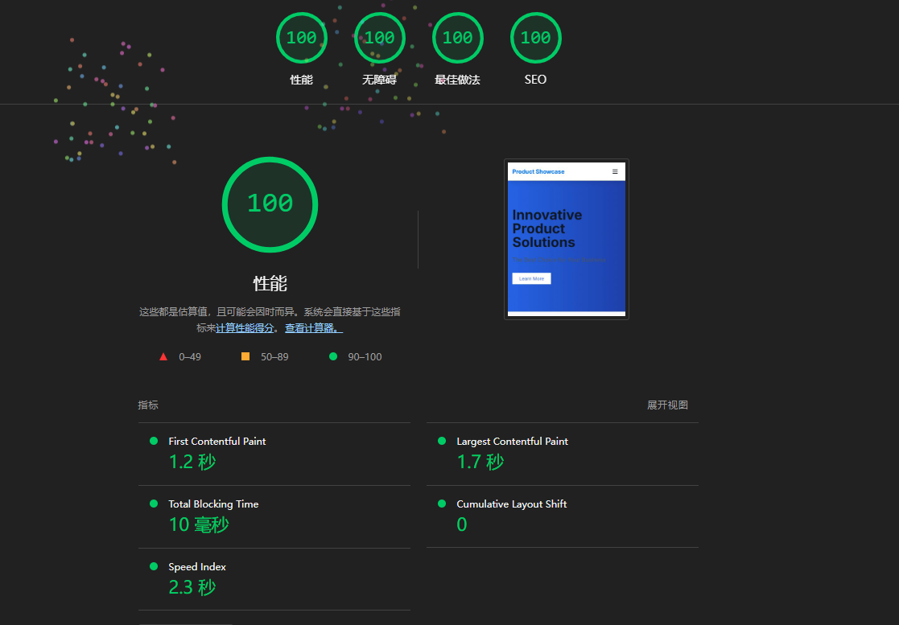
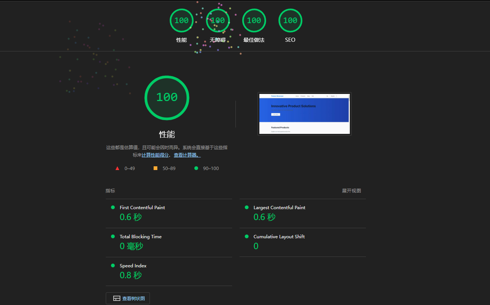

# 多语言产品展示网站

基于 Next.js 14 构建的多语言产品展示网站，支持中英文切换，针对SEO优化，并实现了静态页面生成。

## 技术栈

- Next.js 14
- TypeScript
- next-intl（国际化）
- Tailwind CSS（样式）

## 在线演示
https://product-website-peach.vercel.app

## Lighthouse分数
移动端

桌面端

## 项目结构

```
src/
  ├── app/                    # 应用主目录
  │   └── [locale]/          # 多语言路由
  │       ├── page.tsx       # 首页
  │       ├── products/      # 产品相关页面
  │       └── blog/          # 博客相关页面
  ├── components/            # 公共组件
  ├── content/              # 内容数据目录
  │   ├── en/              # 英文内容
  │   └── zh/              # 中文内容
  ├── i18n/                # 国际化配置
  ├── lib/                 # 工具函数
  ├── messages/            # 翻译文件
  └── types/               # TypeScript 类型定义
```

## 内容管理指南

### 产品内容

产品内容存储在 `src/content/{locale}/products/` 目录下，每个产品使用单独的 JSON 文件。

产品文件结构：
```json
{
  "name": "产品名称",
  "description": "产品描述",
  "image": "/images/products/product1.jpg",
  "features": [
    "特点1",
    "特点2"
  ],
  "specifications": [
    "规格1",
    "规格2"
  ],
  "metadata": {
    "keywords": ["关键词1", "关键词2"],
    "category": "产品分类"
  }
}
```

### 博客文章

博客文章存储在 `src/content/{locale}/blog/` 目录下。

文章文件结构：
```json
{
  "title": "文章标题",
  "description": "文章描述",
  "content": "文章内容",
  "image": "/images/blog/post1.jpg",
  "author": "作者名称",
  "date": "2024-01-01",
  "tags": ["标签1", "标签2"],
  "metadata": {
    "keywords": ["关键词1", "关键词2"],
    "category": "文章分类"
  }
}
```

## 元数据和结构化数据

### 页面元数据来源

1. 首页 (`app/[locale]/page.tsx`)
   - 标题和描述：从 `messages/{locale}.json` 的 `Index` 命名空间获取
   - OpenGraph 数据：基于相同的翻译内容生成

2. 产品列表页 (`app/[locale]/products/page.tsx`)
   - 标题和描述：从 `messages/{locale}.json` 的 `Products` 命名空间获取
   - 产品数据：从 `content/{locale}/products/` 目录读取

3. 产品详情页 (`app/[locale]/products/[id]/page.tsx`)
   - 标题：使用产品名称
   - 描述：使用产品描述
   - 结构化数据：基于产品信息生成 Product Schema
   - OpenGraph：使用产品图片和描述
   - 备用语言链接：自动为所有支持的语言生成

4. 博客列表页 (`app/[locale]/blog/page.tsx`)
   - 标题和描述：从 `messages/{locale}.json` 的 `Blog` 命名空间获取
   - 文章列表：从 `content/{locale}/blog/` 目录读取

5. 博客文章页 (`app/[locale]/blog/[slug]/page.tsx`)
   - 标题：使用文章标题
   - 描述：使用文章描述
   - 结构化数据：基于文章信息生成 Article Schema
   - OpenGraph：使用文章图片、作者和发布日期
   - 备用语言链接：自动为所有支持的语言生成

### 结构化数据示例

1. 产品页面 Schema：
```json
{
  "@context": "https://schema.org",
  "@type": "Product",
  "name": "产品名称",
  "description": "产品描述",
  "image": "产品图片URL",
  "brand": {
    "@type": "Brand",
    "name": "品牌名称"
  }
}
```

2. 文章页面 Schema：
```json
{
  "@context": "https://schema.org",
  "@type": "Article",
  "headline": "文章标题",
  "description": "文章描述",
  "image": "文章图片URL",
  "author": {
    "@type": "Person",
    "name": "作者名称"
  },
  "datePublished": "发布日期"
}
```

## SEO 优化

### 元数据配置

每个页面都配置了完整的元数据，包括：

1. 基本元数据
   - 标题（title）
   - 描述（description）
   - 规范链接（canonical）

2. Open Graph 元数据
   - 标题
   - 描述
   - 类型（type）
   - 图片（适用时）

3. 多语言支持（hrefLang）
   - 所有页面都配置了 hrefLang 标签
   - 自动生成所有支持语言的替代链接
   - 包含规范链接（canonical）
   - 示例配置：
     ```typescript
     alternates: {
       canonical: `/${locale}/products`,
       languages: {
         en: '/en/products',
         zh: '/zh/products'
       }
     }
     ```

4. 结构化数据
   - 产品页：Product Schema
   - 博客页：Article Schema
   - 首页：WebSite Schema

## 图片管理

所有图片按类型分类存储在 `public/images/` 目录下：

```
public/images/
  ├── products/     # 产品图片目录
  │   ├── product1.jpg
  │   ├── product2.jpg
  │   └── ...
  ├── blog/         # 博客图片目录
  │   ├── blog1.jpg
  │   ├── blog2.jpg
  │   └── ...
  └── defaults/     # 默认图片目录
      ├── default-product.jpg  # 产品默认图片
      └── default-blog.jpg     # 博客默认图片
```

### 图片使用规范

1. 产品图片
   - 存放位置：`public/images/products/`
   - 建议尺寸：1200x800 像素
   - 格式：JPG 或 WebP
   - 文件名：使用产品ID或英文名称，如 `product-name.jpg`

2. 博客图片
   - 存放位置：`public/images/blog/`
   - 建议尺寸：1200x630 像素（适合社交媒体分享）
   - 格式：JPG 或 WebP
   - 文件名：使用博客文章的 slug，如 `blog-post-title.jpg`

3. 默认图片
   - 存放位置：`public/images/defaults/`
   - 包含默认产品图片和默认博客图片
   - 用于未设置图片的产品或文章

### 图片优化

- 所有图片通过 Next.js Image 组件加载，自动优化
- 支持响应式图片尺寸
- 自动生成 WebP 格式（如果浏览器支持）
- 图片懒加载（除首屏关键图片外）

## 开发指南

1. 安装依赖：
```bash
npm install
```

2. 开发模式：
```bash
npm run dev
```

3. 构建生产版本：
```bash
npm run build
```

4. 启动生产服务器：
```bash
npm run start
```

## 注意事项

1. 添加新语言时：
   - 在 `src/i18n/config.ts` 中添加语言代码
   - 在 `messages/` 目录下创建对应的翻译文件
   - 在 `content/` 目录下创建对应的内容目录

2. 添加新产品/文章时：
   - 确保所有支持的语言都有对应的内容文件
   - 图片路径使用相对于 `public` 目录的路径
   - 检查并填写所有必要的元数据字段

3. SEO最佳实践：
   - 所有页面都应该有唯一的标题和描述
   - 使用语义化的HTML标签
   - 提供完整的结构化数据
   - 确保所有图片都有合适的 alt 文本
